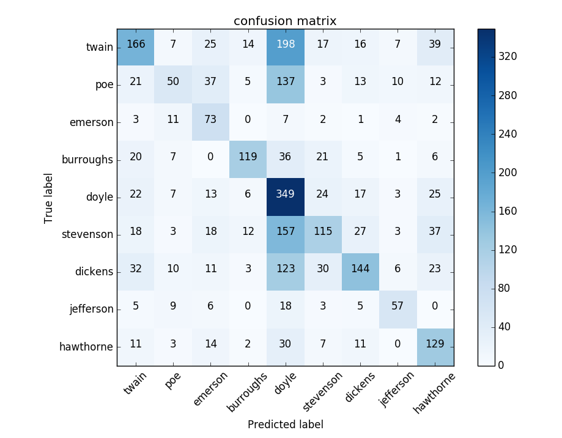

## Naive Bayesian Bernoulli Classification for Identifying Authorship of Text

### <u>Proposal</u>

        This paper is a study in the classification of text by author using a naive bayesian bernoulli supervised 
    learning model. The features of the model are the most frequent 1000 lemmatized words of all texts. The 
    learning machine consumes arrays of 0s and 1s, each number representing whether or not the paragraph contains 
    that particular feature. This program is able to predict authorship, given the occurance of textual features.

### <u>Data and Feature Selection</u>

        The text consumed by the classifier are non-fiction novels written between 1839 and 1884 from various 
    American and English authors. Each row of data in the training set represents the occurance (or non-occurance) 
    of commonly used words from all books per paragraph of text. The amount of data read from each novel is at 
    least greater than 324 KB and not more than 759 KB. Stopwords are omitted as features and words are lemmatized 
    before becoming a feature. Lemmatization is used to reduce redundancy in the feature set and omit variants of 
    stopwords. The number of features was optimized and chosen based on the best performance of a grid search, 
    using values 100, 500, 1000, and 2500.

### <u>Creation of Training Set</u>

        The make_arff.py program reads 7 texts, each by different authors, generates a histogram of word counts, 
    and writes the training data to a file. The most frequently occuring 1000 words are used to construct 
    an arff file that can be read by the classify.py program. The data is generated as such: for each 
    paragraph in a text, iterate through the 1000 words and write a 1 if the word occurs in the paragraph, 
    otherwise write a 0. 
    
        The first element of each record in the arff file is the author and is used to correctly 
    identify the record during the training stage. Each of the 1000 words are declared as an attribute in the 
    arff file, with possible values either 0 or 1. All paragraphs in the text are preprocessed to exclude 
    stopwords and individual words are lemmatized down to their root form. The lemmatization process is conducted 
    with the free and publicly available database called WordNet, via the python package "nltk" (Natural Language 
    Toolkit). Training and test samples are split such that the model is trained on 9/10 of the data and tested 
    on the remaining 1/10. 

        Paragraphs and words are randomly sampled from each text. This aspect of the training set is included to
    reduce bias that may be introduced from the size of paragraphs.

### <u>Execution</u>

        Cross validation is used before execution to find the optimal parameters for alpha, the smoothing factor 
    input into the Bayiasian algorithm. In this study, Laplace smoothing is used to prevent certain features 
    from obfuscating the calcuation of the posterior probability. Since even some of the most common 1000 words 
    of all texts may not occur in a particular text, the probability of that feature would drop to zero without 
    Laplace smoothing. To prevent this effect, these features are given a very small value of alpha instead of 
    zero. The value to use for alpha is discovered through a cross validated grid search.

        A Bayesian Bernoulli model is used to classify the authorship of each paragraph because it is inherently 
    multiclass, interprets binary features, and simple to understand from a probabilistic perspective. When trained, 
    the model learns the prior probabilities without adjustment for each fold of cross validation. The model uses
    the traditional bayesian formula:

        Letting x be the boolean describing whether or not the word occurs in a paragraph, the likelihood can be 
        defined as:

        Where p sub ki is the probability of the feature occuring in the class.

### <u>Evaluation</u>

        After running an instance of the program, the results produced an average precision
    of 78%, average recall of 74%, and an f1 score of 75%. The breakdown is as follows:

| class       | precision   | recall   | f1-score   | support   |
| ----------- | ----------- | -------- | ---------- | --------- |
| burroughs   | .96         | .94      | .95        | 96        |
| dickens     | .88         | .67      | .76        | 341       |
| doyle       | .5          | .77      | .61        | 182       |
| emerson     | .83         | .76      | .79        | 25        |
| hawthorne   | .74         | .86      | .79        | 114       |
| twain       | .68         | .73      | .7         | 195       |
| verne       | .91         | .66      | .76        | 177       |
| avg/total   | .78         | .74      | .75        | 1130      |

        A confusion matrix can provide a more detailed analysis of the correctly and incorrectly
    identified authors.

        The five largest misclassifications that immediately stand out are between the four authors
    dickens, doyle, twain, and verne. In particular, the model tends to produce more false positives for 
    the doyle and twain classes than other classes. This side effect resulted in low precision scores for 
    the doyle and twain categories and deserves follow-up. To speculate - the categories of dickens, doyle, 
    twain, and verne are most likely very similar in features, making the difference in prior probabilities 
    very low between the four.
    
        On the other hand, burroughs produced an extremely high precision score of 96%. This number might imply
    that a certain feature(s) may only exist in the burroughs text. It would be interesting to test this precision
    again on a larger sample size.

----------
### References
C.D. Manning, P. Raghavan and H. Schuetze (2008). Introduction to
Information Retrieval. Cambridge University Press, pp. 234-265.
http://nlp.stanford.edu/IR-book/html/htmledition/the-bernoulli-model-1.html

“Naive Bayes classifier.” Wikipedia, Wikimedia Foundation, 28 Feb. 2018, en.wikipedia.org/wiki/Naive_Bayes_classifier.

